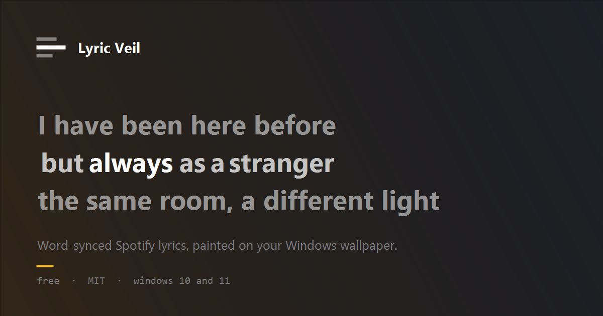

<div align="center">



# Lyric Veil

**Word-synced Spotify lyrics, painted on your Windows desktop.**

[](https://github.com/akshit-bansal11/lyric-veil/actions/workflows/ci.yml)
[](https://github.com/akshit-bansal11/lyric-veil/releases/latest)
[](LICENSE)

[Website](https://lyric-veil.vercel.app) · [Download](https://github.com/akshit-bansal11/lyric-veil/releases/latest) · [Report a bug](https://github.com/akshit-bansal11/lyric-veil/issues)

</div>

---

A frameless, fully transparent, click-through overlay that shows the lyrics of whatever is playing on Spotify, directly on your desktop. The word being sung is at full strength; everything else is the same colour held back. No panel, no album art, no border — and every click passes straight through to whatever is underneath.

Windows 10 (1809+) and Windows 11.

## Read this before you download

**The published `.exe` is tied to my own Spotify application.** The client ID is compiled in at build time, and Spotify keeps new applications in *development mode*, where only accounts the developer has explicitly added are allowed to sign in.

So unless I have added your Spotify account, **the download will install and run but sign-in will fail.** That is a limitation of how Spotify gates new apps, not a bug.

If you are not on that list, [build from source](#build-from-source) with your own client ID. It is free, takes about two minutes, and the app is identical.

## What it does

- **Word-by-word highlight.** The current word is lit; the rest of the line is dimmed. It is a discrete step, not a gradient sweep, so it reads as *this word*.
- **A `Line` mode.** Lyric sources publish line-level timing, so per-word timing is *estimated*. Line mode lights the whole current line instead — the mode that is exactly true to the data. Switch freely.
- **Stays in sync.** Spotify's reported position jitters by 100–200 ms per poll. The overlay runs its own clock and corrects only on the median of recent readings, so the highlight does not visibly speed up and slow down. Seeking and pausing snap immediately.
- **Never in the way.** Click-through, never takes focus, survives <kbd>Win</kbd>+<kbd>D</kbd>, and can sit above every window or behind the ones you are using.
- **Yours to style.** Both colours, opacity, font, weight, size, line height, letter spacing, alignment, position, size, background colour/image, and the number of lines above and below.
- **Offline-friendly.** Lyrics are cached on disk per track. No telemetry, no analytics, no account beyond your own Spotify.

## Install

### Download

Grab the latest [release](https://github.com/akshit-bansal11/lyric-veil/releases/latest):

| File | Use it if |
| --- | --- |
| `LyricVeil-<version>-portable.exe` | You want to run it without installing. |
| `LyricVeil-<version>-setup.exe` | You want a Start-menu entry and an uninstaller. |

The binaries are **unsigned**, so SmartScreen will warn on first launch — *More info → Run anyway*. Signing requires a certificate this project does not have.

Then read [the note above](#read-this-before-you-download) about sign-in.

### Build from source

Requires [Node.js 24+](https://nodejs.org) and a free Spotify client ID.

```bash
git clone https://github.com/akshit-bansal11/lyric-veil
cd lyric-veil
npm install
cp .env.example .env    # paste your client ID into it
npm run dev
```

<details>
<summary><b>Getting a Spotify client ID</b> (free, no secret required)</summary>

1. Open the [Spotify Developer Dashboard](https://developer.spotify.com/dashboard) and create an app.
2. Add this redirect URI **exactly**:

   ```
   http://127.0.0.1:8888/callback
   ```

   It must be `127.0.0.1`, not `localhost` — Spotify rejects `localhost` for new redirect URIs — over `http`, on port `8888`, with the `/callback` path.
3. Under **APIs used**, tick **Web API** only.
4. Copy the **Client ID** from the app's settings into `.env` as `MAIN_VITE_SPOTIFY_CLIENT_ID`.

There is no client secret. Authentication is Authorization Code with PKCE against a loopback redirect, so nothing secret is ever shipped. The only scopes requested are `user-read-playback-state` and `user-read-currently-playing` — both read-only. Lyric Veil cannot control your playback.

The ID is injected at **build** time, so restart `npm run dev` after editing `.env`.
</details>

To produce your own installers:

```bash
npm run package    # → dist/LyricVeil-<version>-portable.exe and -setup.exe
```

## Controls

Global hotkeys — they work whatever has focus.

| Shortcut | Action |
| --- | --- |
| <kbd>Ctrl</kbd>+<kbd>Alt</kbd>+<kbd>L</kbd> | Interactive mode — opens settings, lets you drag and resize |
| <kbd>Ctrl</kbd>+<kbd>Alt</kbd>+<kbd>H</kbd> | Show or hide the overlay |
| <kbd>Ctrl</kbd>+<kbd>Alt</kbd>+<kbd>[</kbd> | Nudge the sync 100 ms earlier |
| <kbd>Ctrl</kbd>+<kbd>Alt</kbd>+<kbd>]</kbd> | Nudge the sync 100 ms later |
| <kbd>Ctrl</kbd>+<kbd>Alt</kbd>+<kbd>0</kbd> | Reset the sync offset |

The tray icon carries show/hide, interactive mode, *hide in fullscreen apps*, *launch at login*, *reconnect Spotify*, *open logs folder* and quit.

Settings open in **their own window, docked beside the overlay** — never on top of it — so every change is visible on the lyrics as you make it. Closing that window leaves interactive mode.

## How it works

```
Spotify /me/player ──1 Hz──▶ poller ──anchor over IPC──▶ clock (frame rate)
        │                       │                             │
        │                  track change                   readPosition
        │                       │                             │
        │                lyrics-service                  word highlight
        │                       │
        └──── LRCLIB ──▶ lrc-parser ──▶ word-timing ──▶ disk cache
```

**The clock is the architecture, not an optimisation.** Spotify is polled once a second; rendering at 1 Hz would be unwatchable. Each poll produces an *anchor* — a reported position plus the wall-clock time the response arrived, taken at the request's midpoint so half the round trip is not baked in as lag — and the renderer extrapolates between anchors at frame rate.

No single anchor is trusted. The errors of the last five are kept and only their **median**, and only past a **90 ms deadband**, becomes a correction, which is then eased in at 8% per frame. One jittery poll moves nothing; real drift is caught within a few seconds. A difference over 700 ms, or a play/pause edge, is a seek and snaps.

`positionMs` never enters React state — it lives in a ref, and the animation loop writes directly to DOM nodes. React state tracks only *which line is active*, which changes a few times a minute.

**Word timings are usually synthesized.** LRCLIB serves line-level LRC, so each line's duration is split across its words: every word first gets a 90 ms floor, and only the surplus is distributed by character weight. Weighting first and clamping afterwards overruns the line end on any line mixing very long and very short words. Enhanced LRC (`<mm:ss.xx>` markers) is parsed and used directly when a source provides it.

## Project layout

```
src/
  shared/     domain model, IPC contract, config, clock arithmetic
  main/       bootstrap, overlay window, settings window, tray, hotkeys
    auth/     PKCE + loopback redirect
    lib/      Spotify client, LRCLIB client, LRC parser, word timing, cache, logger
    services/ playback poller, lyrics resolution, persisted store
  preload/    the contextBridge surface, and nothing else
  renderer/   React: overlay stage, lines, words, interlude dots, settings panel
site/         the microsite (static, no build step)
tests/        vitest — no DOM required
```

| Command | What it does |
| --- | --- |
| `npm run dev` | Run with hot reload |
| `npm run check` | Quality gate: format, lint, typecheck, test |
| `npm test` | Tests only |
| `npm run build` | Typecheck and build all three bundles |
| `npm run package` | Build, then produce the installers in `dist/` |

Config and logs live in `%APPDATA%\lyric-veil\`. Delete that folder for a clean slate.

## Limitations

- **Windows only.** The transparent, click-through, always-on-top behaviour is built on Windows window management.
- **Word timing is estimated** unless the source carries per-word markers, which is uncommon. `Line` mode is the honest one.
- **Lyrics can be wrong or missing.** LRCLIB matches on title, artist, album and duration; a different master of the same song can resolve to timings that are seconds out. The sync offset is the mitigation.
- **Podcasts and local files** have no Spotify track ID, so no lookup is attempted.
- **A free Spotify account works**, but there must be an active device — otherwise the API returns 204 and the overlay shows *Nothing playing*.
- **The binaries are unsigned**, and the released build is tied to my Spotify app (see [above](#read-this-before-you-download)).

## Licence

MIT — see [LICENSE](LICENSE).

Lyrics come from [LRCLIB](https://lrclib.net), a free and open lyrics database. Lyric Veil is not affiliated with Spotify. Cached lyric data is for personal use; do not redistribute it.
